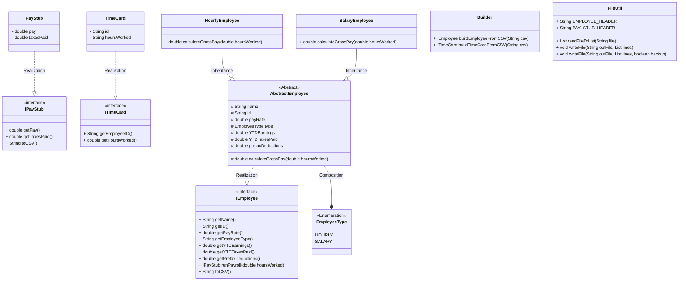
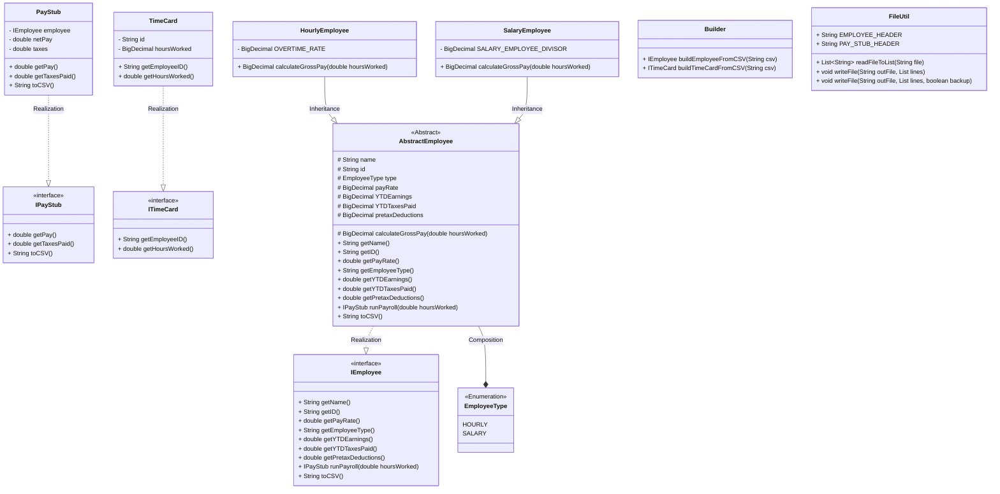

# Payroll Generator Design Document

This document is meant to provide a tool for you to demonstrate the design process. You need to work on this before you code, and after have a finished product. That way you can compare the changes, and changes in design are normal as you work through a project. It is contrary to popular belief, but we are not perfect our first attempt. We need to iterate on our designs to make them better. This document is a tool to help you do that.

## (INITIAL DESIGN): Class Diagram

Place your class diagram below. Make sure you check the fil in the browser on github.com to make sure it is rendering correctly. If it is not, you will need to fix it. As a reminder, here is a link to tools that can help you create a class diagram: [Class Resources: Class Design Tools](https://github.com/CS5004-khoury-lionelle/Resources?tab=readme-ov-file#uml-design-tools)

## (INITIAL DESIGN): Tests to Write - Brainstorm

Write a test (in english) that you can picture for the class diagram you have created. This is the brainstorming stage in the TDD process.

> [!TIP]
> As a reminder, this is the TDD process we are following:
>
> 1. Figure out a number of tests by brainstorming (this step)
> 2. Write **one** test
> 3. Write **just enough** code to make that test pass
> 4. Refactor/update as you go along
> 5. Repeat steps 2-4 until you have all the tests passing/fully built program

You should feel free to number your brainstorm.

1. Test that the `SalaryEmployee` and `HourlyEmployee` class properly returns gross pay from `calculateGrossPay(double hoursWorked)`, `name` from `getName()`, `id` from `getID()`, `payRate` from `getPayRate()`, `employeeType` from `getEmployeeType()`, `YTDEarnings` from `getYTDEarnings()`, `YTDTaxesPaid` from `getYTDTaxesPaid()`, `pretaxDeductions` from `getPretaxDeductions()`, and `PayStub` from `runPayroll(double hoursWorked)`
2. Test that the `PayStub` class properly returns `pay` from `getPay()`, `taxesPaid` from `getTaxesPaid()`, and formatted string from `toCSV()`
3. Test that the `TimeCard` class properly returns `id` from `getEmployeeID()` and `hoursWorked` from `getHoursWorked()`

## (FINAL DESIGN): Class Diagram

Go through your completed code, and update your class diagram to reflect the final design. Make sure you check the file in the browser on github.com to make sure it is rendering correctly. It is normal that the two diagrams don't match! Rarely (though possible) is your initial design perfect.

> [!WARNING]
> If you resubmit your assignment for manual grading, this is a section that often needs updating. You should double check with every resubmit to make sure it is up to date.

## (FINAL DESIGN): Reflection/Retrospective

> [!IMPORTANT]
> The value of reflective writing has been highly researched and documented within computer science, from learning new information to showing higher salaries in the workplace. For this next part, we encourage you to take time, and truly focus on your retrospective.

Take time to reflect on how your design has changed. Write in _prose_ (i.e. do not bullet point your answers - it matters in how our brain processes the information). Make sure to include what were some major changes, and why you made them. What did you learn from this process? What would you do differently next time? What was the most challenging part of this process? For most students, it will be a paragraph or two.

My design doesn't change much. I changed the type of attributes in the `TimeCard` and `AbstractEmployee` classes from `double` to `BigDecimal` to avoid floating-point arithmetic errors. I also added the `Employee` attribute in the `PayStub` class to store the employee information.

I think the instructions is a little bit werid. It told us to write a constructor that looks like this `(String name, String id, double payRate, double ytdEarnings, double ytdTaxesPaid, double pretaxDeductions)`, but why should I use this constructor if we're going to do the calculation on `BigDecimal`. Converting between `double` and `BigDecimal` will only make the number less accurate. I think the instruction should be changed to use `BigDecimal` instead of `double`, or do the calculation on `double`.